# 《安康记 (AnkangCare)》产品功能设计总纲与架构全景 (PRD)

> **文档性质**：家庭健康追踪与急慢性专病监护移动应用 产品需求与功能设计总纲  
> **面向对象**：全家庭多生命周期成员（重点关照：婴幼儿日常/急病护理、老年长辈慢病管理）  
> **文档版本**：v1.0 (Formal Spec)

---

## 1. 产品定位与核心价值主张 (Value Proposition)

### 1.1 产品定位
《安康记》是一款专为中国家庭打造的**全生命周期、多代际协同的健康追踪与病程监护移动应用**。它突破了传统健康工具“指标孤立、千人一面、记录枯燥”的桎梏，围绕**儿童急性病程防慌乱**与**长辈慢病控指标**两大核心痛点，提供场景化、防呆化、极速化的健康数字看板。

### 1.2 三大核心人群与典型痛点

| 目标人群 | 核心生活场景 | 核心用户痛点 | 安康记解决方案 |
| :--- | :--- | :--- | :--- |
| **👶 婴幼儿与儿童** | 日常吃喝拉撒、换季感冒发热、咳嗽流涕、积食腹泻 | • 夜间发烧手忙脚乱，记不清上次给药时间，害怕过量误服 • 口头描述大便模糊，缺乏统一医学标准 • 去医院看病时紧张，说不清发烧起伏与用药史 | • **儿童感冒发热用药安全罗盘**（4-6h 倒计时 + 24h 上限防呆） • **布里斯托 7 级排便卡通图谱** • **一键生成儿科门诊交接长单** |
| **👴 老年长辈** | 高尿酸/痛风、高血压、规律服药、日常排便与饮水 | • 分不清高低嘌呤饮食禁忌，容易踩坑诱发痛风 • 老花眼操作困难，界面字小、按键密 • 经常遗忘服药，在外子女无法及时获知父母身体状况 | • **尿酸 7 天趋势与 420 μmol/L 警戒线** • **食物嘌呤红黄绿灯查询器** • **长辈大字关怀模式 + 协同打卡提醒** |
| **👩👨 家庭管理者 (青年父母)** | 统筹全家健康、月嫂/老人协同带娃、个人日常作息 | • 多人带娃口头沟通低效（“吃过奶没？拉过没？”） • 记录步骤多、交互重，无法单手秒记 | • **家庭健康实时流水线** • **首屏专属 6 项热插拔定制** • **单手 2-Tap 极速录入中心** |

---

## 2. 系统功能架构全景图 (System Architecture)

```mermaid
graph TD
    App[安康记 AnkangCare 移动端] --> M1[模块一：家庭成员与情境感知首页]
    App --> M2[模块二：儿童感冒发热监护与安全用药 核心爆款]
    App --> M3[模块三：极速录入中心与布里斯托图谱]
    App --> M4[模块四：儿科门诊交接单与问诊长图]
    App --> M5[模块五：老人慢病管理与高尿酸指南]
    App --> M6[模块六：家庭档案与专属6项槽位定制]

    M1 --> M1_1[多代际成员滑轨]
    M1 --> M1_2[情境自适应重构状态机]
    M1 --> M1_3[高频4/6卡片看板]
    M1 --> M1_4[实时协同流水流]

    M2 --> M2_1[退热药最小间隔倒计时罗盘]
    M2 --> M2_2[24小时累计服药频次上限]
    M2 --> M2_3[体温与用药双轴走势图]
    M2 --> M2_4[伴随症状与精神状态流]

    M3 --> M3_1[布里斯托7级微拟物图谱]
    M3 --> M3_2[大便危险色相板]
    M3 --> M3_3[配方奶秒选与母乳秒表]
    M3 --> M3_4[高精度步进器]

    M4 --> M4_1[起病热峰结构化摘要]
    M4 --> M4_2[已服退热药清单防重复]
    M4 --> M4_3[精神状态与过敏史核对]
    M4 --> M4_4[高清长图一键导出]

    M5 --> M5_1[7天降酸走势对比420线]
    M5 --> M5_2[食物嘌呤红黄绿灯查询]
    M5 --> M5_3[慢病服药打卡与子女通知]
    M5 --> M5_4[适老化大字模式]

    M6 --> M6_1[家庭档案与过敏源库]
    M6 --> M6_2[首屏6槽位热插拔定制]
    M6 --> M6_3[专病监护开关控制]
```

---

## 3. 设计语言系统规范 (Design System: Warm Therapeutic)

为杜绝传统软件冷冰冰的“医院感”与廉价饱和度拼贴，《安康记》遵循**“暖愈医疗极简主义”**规范：

### 3.1 颜色系统 Tokens

| 色系名称 | 十六进制色值 | 语义化用途 | 心理认知传达 |
| :--- | :--- | :--- | :--- |
| **平静松青 (Primary Teal)** | `#0D9488` | 主品牌色、正常安全指标、主操作按钮 | 舒缓平静、医疗安全感、呼吸感 |
| **珊瑚绯红 (Alert Rose)** | `#F43F5E` | 发热预警、体温超标、退热药锁定、紧急症状 | 醒目警戒但不刺眼，消除恐慌 |
| **沉静靛蓝 (Indigo)** | `#4F46E5` | 慢病管理、老人看板、处方药物、就诊凭证 | 专业严谨、沉稳可靠 |
| **活力温杏 (Amber)** | `#F59E0B` | 喂养摄入、辅食饮食、能量水分 | 温和食欲、儿童活力 |
| **舒缓草木绿 (Emerald)** | `#10B981` | 达标正常、排泄健康、服药打卡完成 | 健康安心、生机活力 |
| **界面底色 (Slate Base)** | `#F8FAFC` | App 全局背景 | 柔和微暖米白，护眼舒适 |

### 3.2 质感与交互原则 (Motion & Touch)
1. **大圆角舒适触感**：主卡片使用 `20px~24px` 大圆角，按钮采用全圆角胶囊 (`9999px`)，贴合手掌操作；
2. **微弥散阴影**：采用 `0 4px 16px -2px rgba(15, 23, 42, 0.05)` 的多重软阴影，营造细腻悬浮层级；
3. **触觉节奏与动效**：遵循 `motion-design` 规范，所有微交互响应在 `150ms~250ms` 内完成，采用 `cubic-bezier(0.4, 0, 0.2, 1)` 减速缓动，严禁拖沓。

---

## 4. 详细模块设计文档索引

本产品功能设计文档已按照架构拆分为 6 个独立的专题规格说明书：

- 📑 **[01_家庭成员与情境感知首页设计.md](file:///c:/AIHome/%E5%AE%89%E5%BA%B7%E8%AE%B0/docs/01_%E5%AE%B6%E5%BA%AD%E6%88%90%E5%91%98%E4%B8%8E%E6%83%85%E5%A2%83%E6%84%9F%E7%9F%A5%E9%A6%96%E9%A1%B5%E8%AE%BE%E8%AE%A1.md)**
- 📑 **[02_儿童感冒发热监护与用药安全罗盘设计.md](file:///c:/AIHome/%E5%AE%89%E5%BA%B7%E8%AE%B0/docs/02_%E5%84%BF%E7%AB%A5%E6%84%9F%E5%86%92%E5%8F%91%E7%83%AD%E7%9B%91%E6%8A%A4%E4%B8%8E%E7%94%A8%E8%8D%AF%E5%AE%89%E5%85%A8%E7%BD%97%E7%9B%98%E8%AE%BE%E8%AE%A1.md)**
- 📑 **[03_极速录入中心与布里斯托排便图谱设计.md](file:///c:/AIHome/%E5%AE%89%E5%BA%B7%E8%AE%B0/docs/03_%E6%9E%81%E9%80%9F%E5%BD%95%E5%85%A5%E4%B8%AD%E5%BF%83%E4%B8%8E%E5%B8%83%E9%87%8C%E6%96%AF%E6%89%98%E6%8E%92%E4%BE%BF%E5%9B%BE%E8%B0%B1%E8%AE%BE%E8%AE%A1.md)**
- 📑 **[04_儿科门诊交接单与问诊长图设计.md](file:///c:/AIHome/%E5%AE%89%E5%BA%B7%E8%AE%B0/docs/04_%E5%84%BF%E7%AB%A5%E9%97%A8%E8%AF%8A%E4%BA%A4%E6%8E%A5%E5%8D%95%E4%B8%8E%E9%97%AE%E8%AF%8A%E9%95%BF%E5%9B%BE%E8%AE%BE%E8%AE%A1.md)**
- 📑 **[05_老年慢病管理与高尿酸高嘌呤指南设计.md](file:///c:/AIHome/%E5%AE%89%E5%BA%B7%E8%AE%B0/docs/05_%E8%80%81%E5%B9%B4%E6%85%A2%E7%97%85%E7%AE%A1%E7%90%86%E4%B8%8E%E9%AB%98%E5%B0%BF%E9%85%B8%E9%AB%98%E5%91%8C%E5%91%A4%E6%8C%87%E5%8D%97%E8%AE%BE%E8%AE%A1.md)**
- 📑 **[06_家庭档案与专属6项槽位定制设计.md](file:///c:/AIHome/%E5%AE%89%E5%BA%B7%E8%AE%B0/docs/06_%E5%AE%B6%E5%BA%AD%E6%81%A3%E6%A1%88%E4%B8%8E%E4%B8%93%E5%B1%9E6%E9%A1%B9%E6%A7%BD%E4%BD%8D%E5%AE%9A%E5%88%B6%E8%AE%BE%E8%AE%A1.md)**
