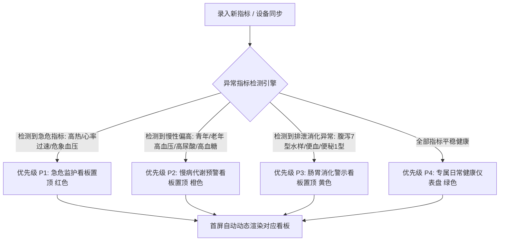

# 模块一：家庭成员与情境感知首页设计规格书 (P1)

> **所属系统**：安康记 (AnkangCare) 移动端  
> **文档代号**：SPEC-MODULE-01  
> **状态**：正式发布 (Approved)

---

## 1. 业务背景与用户痛点分析

家庭健康管理具有极其显著的**多代际、多角色、多异构需求**特征：
- **年轻父母（25~35岁）**：关注个人水分摄入、体脂与生理期，同时主导全家健康统筹；
- **婴幼儿（0~3岁）**：无自主表达能力，指标高度碎片化（奶量按毫升算、大便按次算、体温精确到 0.1℃）；
- **老年长辈（60岁以上）**：痛风慢病管理，关注尿酸、血压、规律服药，且多伴有老花眼。

> [!WARNING] 传统健康 App 的核心缺陷：
> 界面千人一面、死板固化。当孩子突然半夜发烧到 39℃ 时，焦急的家长打开 App 仍然看到满屏的“计步数、睡眠分析、饮水打卡”，无法在 1 秒内触达体温与退热药看板，造成极大的心理负担与操作延误。

---

## 2. 核心架构：异常指标驱动的自适应看板升权引擎 (Anomaly-Driven Morphing Engine)

针对“青年人也会面临高血压、高尿酸，儿童也可能出现腹泻脱水”等真实健康交织场景，本系统突破了传统“按年龄切分模板”的死板逻辑，构建了**“生命周期底色 + 异常指标主动升权”**的双层决策状态机：

> [!IMPORTANT] 核心原则：异常指标高于一切默认日常展示！
> 无论成员是婴儿、青年、孕妇还是老年人，只要最新录入或生理设备同步的数据触发了**医学异常阈值**，首屏立即从默认日常模式自动**升权置顶为警示色干预看板**。



### 2.1 全人群通用异常指标判定与升权矩阵 (Anomaly Rules)

| 触发异常指标 | 适用人群举例 | 判定门槛阈值 (Threshold) | 首屏看板自动变身形态 (Hero Morphing) | 关键信息与干预动作展示 |
| :--- | :--- | :--- | :--- | :--- |
| **血压超标 (高血压)** | **青年白领** / 老年人 / 孕期女性 | **收缩压 ≥ 140 或 舒张压 ≥ 90 mmHg**<br>*(或严重级 ≥160/100)* | 变身为 **❤️ 血压异常预警看板 (橙/红)** | 提示安静静坐 15 分钟复测；关联低钠控盐指南与就医指引 |
| **高尿酸血症** | **年轻男士** / 痛风长辈 / 啤酒爱好者 | **血尿酸 > 420 μmol/L** | 变身为 **🧪 尿酸偏高警报看板 (橙)** | 标绘 420 警戒线，强提醒今日禁浓汤海鲜啤酒，提示饮水 2000ml |
| **发热 / 体温异常** | 婴幼儿 / 儿童 / 成人感染流感 | **腋温 ≥ 37.5℃ (低热) 或 ≥ 38.5℃ (高热)** | 变身为 **🤒 发热病程监护看板 (红)** | 置顶退热药安全间隔倒计时罗盘与双轴走势，防夜间误服 |
| **重度排便异常** | 婴儿 / 幼儿 / 青年水土不服 | **布里斯托 7 型 (水样蛋花便) 或 表面带血** | 变身为 **💩 肠道警示看板 (黄/红)** | 警惕脱水与肠炎，提示补充口服补液盐 (ORS)，建议留样送检 |
| **心率 / 脉搏异常** | 青年熬夜 / 老人房颤心律不齐 | **静息心率 > 100 bpm (心动过速) 或 < 50 bpm** | 变身为 **⚡ 心率节律预警看板 (红)** | 提示停止剧烈运动与咖啡因摄入，记录伴随胸闷/心悸情况 |

### 2.2 多重异常并发时的优先级裁决 (Triage Rank)
当某位成员（例如加班熬夜的年轻爸爸）同时存在多个健康问题时，首屏英雄看板按医学危险等级严格裁决：
$$\text{急性高热 / 严重危象血压 (P1)} > \text{急性重度腹泻脱水 (P2)} > \text{慢病高尿酸 / 轻度高血压 (P3)} > \text{日常饮水与计步 (P4)}$$
次级异常指标则以高亮 Badge 徽章形式呈现在卡片下方，确保关键急症绝不被淹没。

---

## 3. 功能点详细规范 (Feature Specifications)

### 3.1 家庭成员快捷滑轨 (Member Slider)
- **展示形态**：首页顶部横向平滑滚动卡片，支持手势滑动，默认首项为当前激活成员。
- **信息单元**：
  - 头像区：支持卡通 Emoji 或相册自定义真实照片，右上角带**状态提示小红点/小蓝点**；
  - 文本区：第一行为「姓名 (角色关系与年龄)」，如 `安安 (8个月)`；第二行为「即时健康标签」，如 `🤒 发热 38.5℃`、`🧪 尿酸 485 需控`、`🌿 健康日常`。
- **交互行为**：
  - 点击任意成员卡片：首屏触发平滑微动效，英雄看板（Hero Board）与 4/6 高频卡片即时重组；
  - 末尾固定放置「+ 管理家人」胶囊入口，点击跳转成员档案配置中心。

### 3.2 动态英雄看板 (Dynamic Hero Board)
根据状态机重排的三大看板形态：

| 模式 | 顶部横幅文案 | 核心卡片 1 | 核心卡片 2 | 快捷功能出口 |
| :--- | :--- | :--- | :--- | :--- |
| **儿童发热急病态** | ⚠️ 感冒发热监护 · 第 N 天 | **当前体温 (腋温)**<br>数值标红，如 38.5℃，显示热度分级（中度发热） | **退热药安全罗盘**<br>显示倒计时与状态（“安全可服”/“锁定等待”） | 右上角点击直达「儿科门诊交接单」 |
| **老人慢病管理态** | 🧪 尿酸与代谢慢病管理 | **今晨指尖血尿酸**<br>数值展示，对比 420 警戒线，显示偏高状态 | **血压与脉搏**<br>如 126/80 mmHg，显示正常达标 | 右上角点击直达「食物嘌呤红黄绿灯」 |
| **成人健康日常态** | 🌿 全家健康中枢 | **今日饮水量**<br>显示摄入总量与百分比，如 1800ml (100%) | **晨起体重 / BMI**<br>显示当日打卡数值与体态标准评级 | 右上角点击查看生理期预测/作息分析 |

### 3.3 今日高频 4/6 指标卡片 (Quick Metrics Matrix)
- **心智模型设计**：限制首屏同时展示的日常卡片数量为 4 或 6 张（符合米勒定律 7±2 认知负荷理论）。
- **指标卡交互**：
  - 卡片顶部显示指标图标与名称（如 `🍼 今日总奶量`）；
  - 中间显示当日累计绝对值（如 `580 ml`）；
  - 底部显示辅助标签（如 `达成 72% · 距上次打卡 2.5h`）；
  - **单触反馈**：轻点任意卡片，即刻自底向上滑出该指标的「极速录入抽屉 (Bottom Sheet)」，免去跳转新页面的等待成本。

### 3.4 实时家庭健康协同流水线 (Family Activity Stream)
- **业务价值**：解决“月嫂给宝宝喂了奶但妈妈不知道”、“爸爸在单位挂念家里老人吃药”的沟通壁垒。
- **展示格式**：
  - 时间戳（精确至分钟，如 `09:15`）；
  - 动作摘要（如 `测得体温 38.5℃ (腋温)`、`配方奶 160ml`）；
  - 辅助备注（如 `额头微烫，伴随流清涕，精神尚可`）；
  - **打卡人署名**：如 `👤 奶奶 记录`、`👤 妈妈 林女士 记录`。
- **数据同步机制**：支持本地离线缓存，网络恢复后自动合并同步，毫秒级推送给家庭组其他成员。

---

## 4. 字段字典与数据模型 (Data Schema)

```json
{
  "member_id": "mem_001",
  "name": "安安",
  "role": "次子",
  "birth_date": "2025-02-10",
  "stage": "infant",
  "current_status": {
    "is_illness_mode": true,
    "illness_type": "fever_cold",
    "illness_start_time": "2026-10-06T02:00:00Z",
    "latest_temp": 38.5,
    "last_medication": {
      "drug_name": "对乙酰氨基酚 (泰诺林)",
      "dose": "3.5ml",
      "timestamp": "2026-10-06T04:45:00Z"
    }
  },
  "quick_slots": [
    "milk", "poop", "temp", "diet", "med", "sleep"
  ]
}
```

---

## 5. 异常情况与边界规则处理

1. **断网离线状态**：
   - App 本地存储基于 SQLite/Room 实时读写，离线状态下打卡完全不受阻碍；
   - 顶部协同状态展示为 `● 离线打卡 (待同步 2 条)`，连网后静默补传。
2. **多用户并发打卡冲突**：
   - 采用**时间线追加模式（Append-Only Event Stream）**，而非简单覆盖。例如爸爸和奶奶在同一分钟记录了喂奶，时间线将显示两条记录，并弹窗提示家长核对是否属于同一喂养事件。
