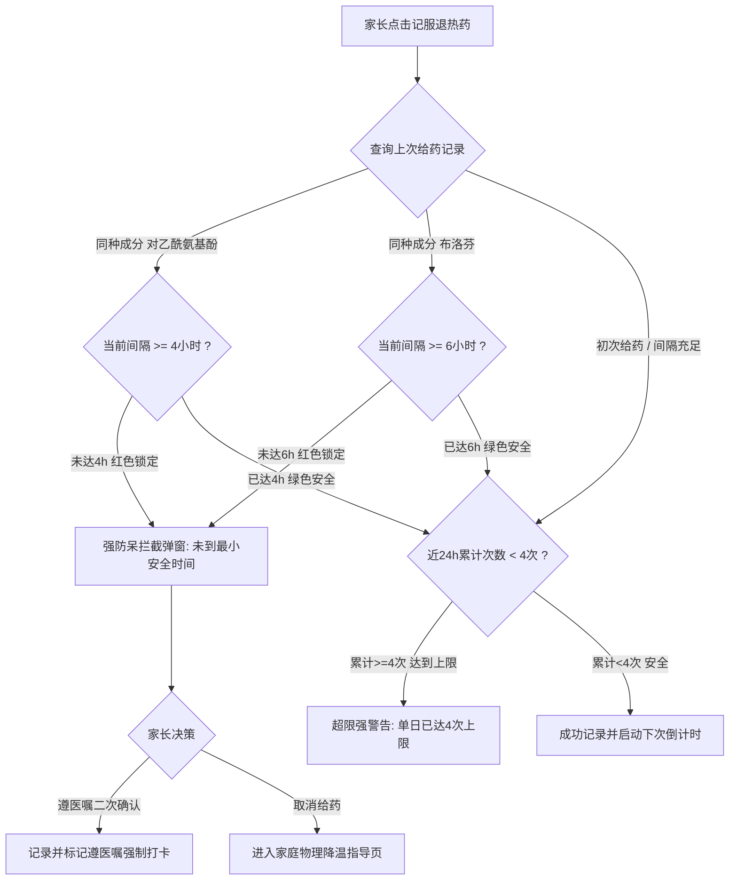

# 模块二：儿童感冒发热监护与用药安全罗盘设计规格书 (P2 · 核心爆款)

> **所属系统**：安康记 (AnkangCare) 移动端  
> **文档代号**：SPEC-MODULE-02  
> **状态**：正式发布 (Approved)

---

## 1. 业务痛点与设计背景 (The Problem)

儿童感冒发热是全国家庭最常见的急性看护场景，也是家长恐慌指数最高的时刻：
1. **夜间高烧慌乱**：夜间孩子体温升至 38.5℃~39℃ 时，疲惫焦虑的家长极易记混上次给药时间；
2. **重复给药与中毒风险**：小儿退热药核心成分主要是**对乙酰氨基酚（如泰诺林）**与**布洛芬（如美林）**。两种药物具有严格的代谢半衰期。若间隔时间过短或频繁换药，会导致严重的蓄积性肝肾损伤；
3. **伴随症状与重症识别盲区**：许多家长只盯体温计数值，忽略了精神状态、呼吸急促等关键重症征兆。

---

## 2. 核心架构：退热药安全罗盘防呆引擎 (Safety Compass Engine)

### 2.1 临床药理学安全校验规则库

| 药物成分 | 常见商品名 | 最小法定安全间隔 | 建议给药间隔 | 24小时最大频次 | 适用年龄底线 |
| :--- | :--- | :--- | :--- | :--- | :--- |
| **对乙酰氨基酚** | 泰诺林滴剂/混悬液 | **4 小时** | 4 ~ 6 小时 | **≤ 4 次** | 3 个月以上 |
| **布洛芬** | 美林滴剂/混悬液 | **6 小时** | 6 ~ 8 小时 | **≤ 4 次** | 6 个月以上 |

> [!CAUTION] 强防呆拦截交互逻辑：
> - 当系统检测到未满最小间隔时，罗盘展示为**红色警示弧**，文字标注 `锁定等待期 (剩余倒计时 X.X 小时)`；
> - 家长尝试点击给药时，弹出全屏阻断式弹窗（Modal）：明确警示“未到安全时间，频繁用药有肝损伤风险！建议温水擦浴松解衣物”，必须长按 3 秒或勾选“遵医嘱遵处方”方可二次确认。

---

## 3. 双轴体温与用药走势图设计 (Dual-Axis Timeline)

### 3.1 坐标系设计规范
- **X 轴（时间轴）**：固定展示过去 24 小时（可横向平滑拖动回溯 48 小时），以 2 小时为时间主刻度；
- **Y 轴（温度轴）**：动态区间 36.0℃ ~ 40.5℃，刻度步进 0.5℃；
- **警戒基准线**：在 **38.5℃** 处绘制一条**红色虚线 (Dashed Line)**，标注 `警戒线: 38.5℃ (药物降温门槛)`。

### 3.2 叠加热力与用药标记
1. **体温平滑曲线**：
   - 温度点连线采用三阶贝塞尔平滑曲线，实测体温点用小圆点标绘；
   - 温度 `< 38.5℃` 标草木绿；温度 `>= 38.5℃` 标珊瑚红；
2. **服药标记胶囊 (Med Mark)**：
   - 当在某时刻记录了退热药，在曲线对应时间点的垂直上方悬浮展示一颗**紫色胶囊图标（💊）**；
   - 点击该胶囊，展开小气泡：`美林 3.0ml (22:00)`；
   - 直观向医生展示：**服药后 45 分钟体温是否顺利回落、在何处达到波谷、维持多少小时后再次反弹**。

---

## 4. 全维度伴随症状与精神状态流 (Symptom & Triage)

精神状态是儿科急诊判定病情严重程度的**第一黄金指标**。

### 4.1 精神状态四级评分量表

| 等级 | 标签文案 | 临床表现 | 界面反馈 |
| :--- | :--- | :--- | :--- |
| **Level 1** | 😊 精神良好 | 退烧后玩耍如常、眼神聚焦、有互动笑脸 | 绿色标签，平稳观察 |
| **Level 2** | 😢 哭闹黏人 | 上升期身体不适、哼唧哭闹、需要抱抱 | 黄色标签，予以安抚 |
| **Level 3** | 😴 嗜睡发蔫 | 退热后依然精神萎靡、疲倦少动、食欲骤降 | 橙色标签，密切监护 |
| **Level 4** | 🚨 萎靡不振/呼之不应 | 眼神呆滞、唤醒困难、肢体无力、持续尖叫 | **强红色全屏预警，立即就医** |

### 4.2 伴随症状快速点选标签
- **呼吸与咳嗽**：[无咳嗽]、[偶发干咳]、[频繁深咳]、[伴有痰鸣音]、[喘鸣/犬吠样（哮吼报警）]；
- **鼻部体征**：[流清鼻涕]、[浓黄稠涕]、[严重鼻塞]；
- **消化与神经**：[呕吐 1次]、[腹泻水样便]、[发冷寒战]、[惊厥抽搐（红线预警）]。

---

## 5. 儿科急诊送医红线指南 (Emergency Red Flags)

当命中以下任意一条规则时，页面首屏浮出橙红高亮横幅，提示家长即刻动身前往医院：

> [!IMPORTANT] 必须立即就医红线清单：
> 1. **超小月龄**：未满 3 个月的婴儿，只要体温 ≥ 38.0℃；
> 2. **超高热**：体温超过 40.0℃ 且退热药无法降温；
> 3. **抽搐惊厥**：出现双眼上翻、四肢抽动、口吐白沫、呼之不应；
> 4. **呼吸窘迫**：呼吸急促（安静时喉部凹陷、鼻翼扇动、锁骨上窝凹陷）；
> 5. **病程过长**：发热持续超过 72 小时（3 天）无好转趋势。
