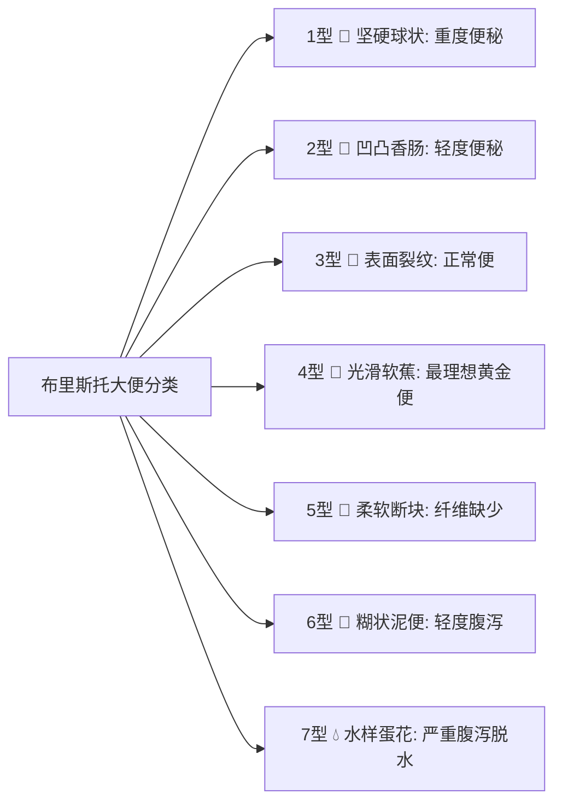

# 模块三：极速录入中心与布里斯托排便图谱设计规格书 (P3)

> **所属系统**：安康记 (AnkangCare) 移动端  
> **文档代号**：SPEC-MODULE-03  
> **状态**：正式发布 (Approved)

---

## 1. 业务痛点与极速交互原则 (UX Principles)

### 1.1 核心痛点
1. **单手怀抱婴儿时的记录困境**：宝妈常常一手抱娃、一手操作手机。传统 App 包含大量下拉选择框、日期选择器，无法在 3 秒内完成打卡；
2. **大便口头描述缺乏标准**：老人或月嫂描述宝宝大便“有点稀”、“好像拉肚子”，医生询问时无法精确界定；
3. **母乳亲喂计时繁琐**：左右乳房需交替喂养，家长看钟表心算容易遗忘。

### 1.2 交互设计铁律 (2-Tap Rule)
- **单手黄金操作区**：所有高频操作元素均分布在屏幕下半部（底部抽屉 Bottom Sheet 结构）；
- **2-Tap 秒记**：从点击“+ 极速记一条”到完成保存，高频操作（如记一次 150ml 奶、记一次 4 型黄金大便）必须在 **两次点击（2-Tap）** 内部完成。

---

## 2. 布里斯托 7 级排便医学图谱化 (Bristol Stool Scale)

本模块严格按照国际医学公认的**布里斯托大便分类法（Bristol Stool Form Scale）**，并采用**温和微拟物卡通卡片**消除真实排泄物带来的视觉不适感：

### 2.1 七大形态视觉卡片与临床解读

| 型号 | 卡通图标 | 视觉特征 | 临床健康状态解读 | 界面配色与标签 |
| :--- | :--- | :--- | :--- | :--- |
| **1型** | 🌰 | 颗颗坚硬、像羊粪球、排便费力 | 重度便秘，需补充水分与油脂膳食纤维 | 棕灰，提示便秘 |
| **2型** | 🥖 | 凹凸不平的干硬腊肠块 | 轻度便秘，肠道水分吸收过度 | 浅褐，轻度预警 |
| **3型** | 🌭 | 表面有裂纹的香肠软块 | 正常大便，形态较为规律 | 绿标，正常 |
| **4型** | 🍌 | **光滑柔软如香蕉，一冲即净** | **最理想的黄金大便（标准形态）** | **草木绿，健康达标** |
| **5型** | 🥔 | 边缘光滑的柔软小块 | 正常偏软，胃肠蠕动较快 | 浅绿，正常 |
| **6型** | 🥣 | 边缘松散、糊状泥便、无固定形态 | 轻度腹泻/吸收不良/乳糖消化不全 | 橙黄，注意消化 |
| **7型** | 💧 | 蛋花汤水样、无固体块 | **重度腹泻，存在脱水电解质紊乱风险** | **红色警示，警惕脱水** |

### 2.2 便便色相调色板与危险警示
提供 4 类标准取色块：
- 🟡 **金黄色**：生理期最理想颜色（母乳喂养常见）；
- 🟢 **墨绿色**：配方奶高铁氧化、或饥饿肠蠕动加快，通常为生理性；
- 🟤 **棕褐色**：添加辅食与肉类后的正常成人化大便；
- 🔴 **带血红 (强警示)**：大便表面带血丝或深红血便（肛裂、牛奶蛋白过敏性肠炎或细菌性肠炎），系统自动弹出红色警告“建议留样就医化验”。

### 2.3 异常伴随特征快速勾选
- `[+ 有白色奶瓣]`（脂肪未充分皂化）；
- `[+ 泡沫极多]`（乳糖发酵过盛）；
- `[+ 有黏液拉丝]`（肠道黏膜轻度脱落）；
- `[+ 气味酸臭]`（碳水消化不良）。

---

## 3. 喂奶双模式秒记：瓶喂容量 + 亲喂秒表

### 3.1 配方奶 / 瓶喂模式 (Volume Mode)
- **快捷容量胶囊**：页面首排提供 5 个婴儿最高频容量胶囊：`90ml`、`120ml`、`150ml`、`180ml`、`210ml`。单点一次即完成容量选中；
- **微调步进器 (Stepper)**：提供居中大号数字展示与两侧 `－` `＋` 大号圆形按钮，步进为 10ml，长按可连续快速递增。

### 3.2 母乳亲喂模式 (Breastfeeding Stopwatch)
针对纯母乳亲喂无法直接称量毫升数的痛点，提供**双侧秒表计时器**：
- **左侧 / 右侧独立计时**：
  - 点击「开始左乳喂养」，大号秒表跳动；
  - 换边时点击「换到右侧」，系统自动保存左侧时长（如 12分20秒），无缝开启右侧秒表；
- **自动防忘提示**：若计时超过 45 分钟未暂停，系统发出震动提示“请确认宝宝是否已含乳入睡”。

---

## 4. 关键指标高精度调节器 (Precision Steppers)

| 指标类型 | 默认初值 | 调节步进 | 极限区间 | 单位 | 视觉与状态反馈 |
| :--- | :--- | :--- | :--- | :--- | :--- |
| **体温 (Temp)** | 38.5 | **0.1** | 35.0 ~ 42.0 | ℃ | `<37.3`绿 / `37.3-38.4`黄 / `>=38.5`红 |
| **指尖血尿酸** | 485 | **5** | 100 ~ 900 | μmol/L | `<=420`草木绿 / `>420`警戒橙红 |
| **配方奶量** | 150 | **10** | 10 ~ 400 | ml | 达成目标比例进度环反馈 |
| **饮水量** | 200 | **50** | 50 ~ 3000 | ml | 波浪注水微动效 |
