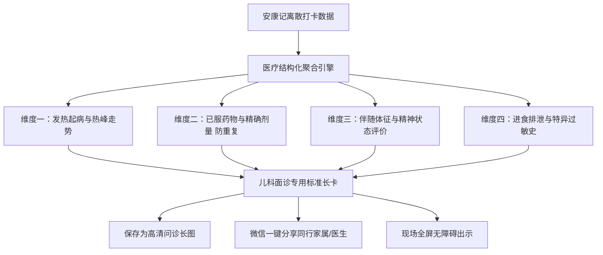

# 模块四：儿科门诊交接单与问诊长图设计规格书 (P4)

> **所属系统**：安康记 (AnkangCare) 移动端  
> **文档代号**：SPEC-MODULE-04  
> **状态**：正式发布 (Approved)

---

## 1. 业务痛点与门诊场景分析 (Clinical Context)

带娃看病是全国家庭体验最痛苦的就医场景之一：
1. **“排队两小时，看诊三分钟”**：三甲儿科门诊极度拥挤，医生看一个号的时间往往只有 3~5 分钟；
2. **家长紧张遗忘、表述模糊**：面对医生连珠炮式的提问：*“发烧几天了？最高几度？上次吃退烧药是几点？吃的什么药？吃了多少毫升？精神好不好？拉肚子吗？”*，本就焦虑疲惫的家长极易记混甚至张冠李戴；
3. **最严重的医疗风险：医院重复给药**：若家长讲不清楚上次吃的是美林还是泰诺林、吃了多少毫升，急诊医生很难安全给药，严重影响急救时效。

---

## 2. 儿科门诊结构化四大黄金交接维度

本功能严格遵循三甲儿科主治医师的问诊习惯，将离散的日常数据转化为医疗专业交接单：

### 2.1 维度详细定义与格式标准

| 维度名称 | 核心临床问题 | 结构化呈现示例 | 临床价值 |
| :--- | :--- | :--- | :--- |
| **1. 发热病程与热峰** | 起病确切时长？最高温度？热峰频次？ | • **起病时间**：昨日 02:00，已持续约 31 小时 • **最高体温**：**39.1 ℃** (昨日 19:15 腋温) • **热峰走势**：24h内高热起伏 3 次，服药后体温能顺利降至 37.4℃ 左右 | 帮助医生判断是典型病毒性感冒、幼儿急疹还是细菌感染 |
| **2. 已服退热药清单** | 吃了什么药？吃了多少？距离现在多久？ | • 昨 12:40：布洛芬滴剂 3.0ml • 昨 19:15：对乙酰氨基酚 3.5ml • 今 04:45：对乙酰氨基酚 3.5ml (已间隔 4.5h+) ★ **当前无用药过量蓄积风险** | 彻底消除门诊重复给药风险，医生可放心下达退热医嘱 |
| **3. 伴随症状与精神** | 咳不咳？喘不喘？精神如何？抽搐过吗？ | • 伴随清鼻涕，晨起偶发干咳 2-3 声 • **无抽搐惊厥，无气促喘鸣，无全身皮疹** • **精神状态**：退烧后能正常玩耍，发热时哭闹 | 迅速排除急性喉炎、重症肺炎、热性惊厥与脑膜炎 |
| **4. 排泄与过敏史** | 吃奶怎样？拉肚子吗？对什么过敏？ | • 配方奶日均约 700ml，饮水 200ml • 大便正常 2次/日，黄金色4型软便 • **已知过敏史**：鸡蛋清轻度湿疹；无药物过敏史 | 评估是否脱水，指导抗生素皮试与饮食医嘱 |

---

## 3. 高清问诊长图生成引擎 (Export Engine)

### 3.1 视觉排版规范 (Print-Ready Layout)
- **纸张质感**：背景采用无反光纯白医疗纸质感底色，搭配浅灰细虚线网格；
- **排版结构**：
  - 顶栏：右上角防伪印章样式标注 `儿科门诊交接专用`；
  - 抬头区：患儿姓名、性别、精确月龄（如 `安安 · 8个月 · 男`）、导出时间戳与监护人电话；
  - 主体区：4 大维度结构化排布，加粗标记最高体温与已服药物毫升数；
  - 底栏：安康记医疗数据时间戳防伪标识。

### 3.2 交互流转形态
1. **一键生成长图并存入相册**：调用移动端 Canvas 渲染高清 Bitmap（分辨率宽度固定为 `1080px`，高度自适应），无损保存至系统相册；
2. **微信一键分发**：直接调用系统原生分享面板，支持将长图或轻量小程序卡片发送给在医院挂号的爸爸或随行老人；
3. **现场展示大字横屏模式**：提供“横屏翻转”按钮，点击后自动全屏横屏展开长卡，字体放大 150%，便于医生隔着诊台一眼扫视完毕。
