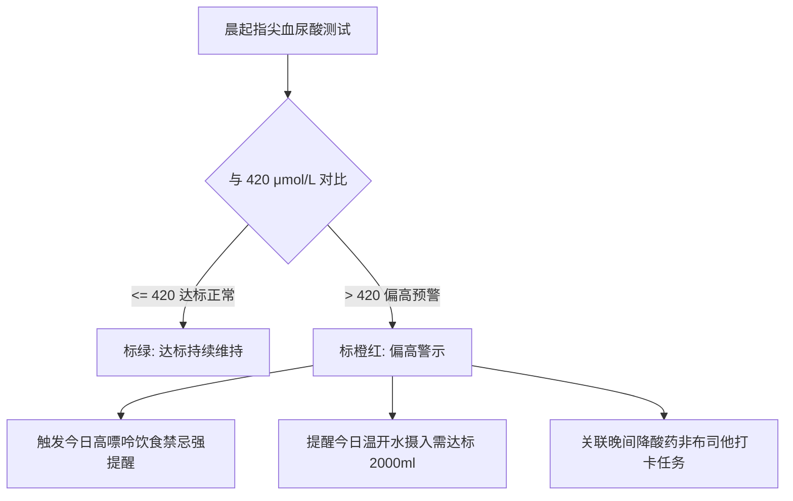

# 模块五：老年慢病管理与高尿酸高嘌呤指南设计规格书 (P5)

> **所属系统**：安康记 (AnkangCare) 移动端  
> **文档代号**：SPEC-MODULE-05  
> **状态**：正式发布 (Approved)

---

## 1. 业务痛点与银发族慢病特征 (Elderly Care)

随着人口老龄化与饮食结构变化，老年人群健康管理痛点极为严峻：
1. **高尿酸血症与痛风高发**：痛风发作时关节剧痛难忍，且饮食禁忌繁琐，老人常分不清哪些食物能吃、哪些绝对不能吃；
2. **多重慢病服药易遗漏**：降压药（如络活喜）、降酸药（如非布司他）需要长年按时服用，老人极易漏服或重复服药；
3. **老花眼与交互障碍**：手机字小、图标密、按键小，老年人产生强烈的科技畏难情绪；
4. **子女远程挂念却信息脱节**：在外工作的子女想关心父母血压和尿酸，但口头电话询问往往只得到一句报喜不报忧的“都挺好”。

---

## 2. 指尖血尿酸 7 天走势看板与 420 基准线 (Uric Acid Tracker)

### 2.1 临床警戒阈值：420 μmol/L
- **国际医学共识**：血尿酸饱和溶解度临界点为 **420 μmol/L**（约 7.0 mg/dL）。超过该阈值，尿酸盐结晶开始在关节腔析出沉积，痛风发作风险骤增；
- **警戒基准线绘制**：走势图固定在 `Y = 420` 处绘制一条粗虚线，标注 `达标线 420 μmol/L`；
- **达标率自动统计**：每周自动计算“近 7 天达标天数（如 2/7 天）”，形成降酸药物疗效量化反馈。

---

## 3. 高中低嘌呤食物红黄绿灯查询器 (Purine Traffic Light)

针对长辈最关心的“这个菜能不能吃”，设计分类速查器：

| 信号灯级别 | 嘌呤含量范围 | 典型代表食材 | 饮食与烹饪医嘱 |
| :--- | :--- | :--- | :--- |
| **🔴 极高嘌呤 (红灯 · 禁忌)** | **> 150 mg / 100g** | **浓肉汤/骨头老火汤**、动物内脏、沙丁鱼/凤尾鱼、生蚝贝类、**啤酒与白酒** | **痛风期与高尿酸期绝对严禁**；严禁饮用涮火锅久煮浓汤 |
| **🟡 中等嘌呤 (黄灯 · 限量)** | **50 ~ 150 mg / 100g** | 猪牛羊水煮瘦肉、大豆制品/豆腐、菠菜、菌菇类、淡水鱼肉 | 痛风缓解期可适量食用；**肉类建议先焯水弃汤后再烹饪** |
| **🟢 极低嘌呤 (绿灯 · 推荐)** | **< 50 mg / 100g** | **脱脂纯牛奶**、鸡蛋、白菜/黄瓜/番茄等绝大部分蔬菜、温开水 | **强烈推荐每日足量摄入**；脱脂牛奶能促进尿酸排泄 |

---

## 4. 慢病服药打卡与家庭协同推送 (Medication Loop)

### 4.1 长辈一键大字打卡
- 界面提供清晰的药丸卡片：
  - `晨间降压药 · 络活喜 5mg (饭后半小时)`
  - `晚间降酸药 · 非布司他 20mg (晚饭后)`
- 长辈只需点击大号按钮 `[ 点击打卡已服药 ]`，按钮立即变灰并显示 `已打卡 ✓`，杜绝重复吃药。

### 4.2 子女端实时温情推送
- **实时同步机制**：长辈打卡后，系统毫秒级向子女手机推送通知：
  > *“📢 爷爷已于 07:40 完成晨间降压药打卡，血压 126/80 mmHg 达标！”*
- **防遗漏报警**：若设定时间后 1 小时仍未打卡，子女手机收到提醒：*“爷爷今日尚未打卡晚间降酸药，请致电关心！”*

---

## 5. 适老化关怀大字模式 (Senior Accessibility Mode)

本模块符合国家工信部移动互联网应用适老化及无障碍标准：
1. **全局大字号**：开启大字模式后，全局字体放大至 **125%~135%**，正文不小于 `16sp`，避免老花眼疲劳；
2. **加大触控热区**：所有操作按钮最小高度不低于 **48dp**，两按键间距不小于 **12dp**，严防误触；
3. **极高对比度**：去除低对比度灰底细字，文字与背景对比度达到 **4.5:1** 以上，边缘清晰锐利。
