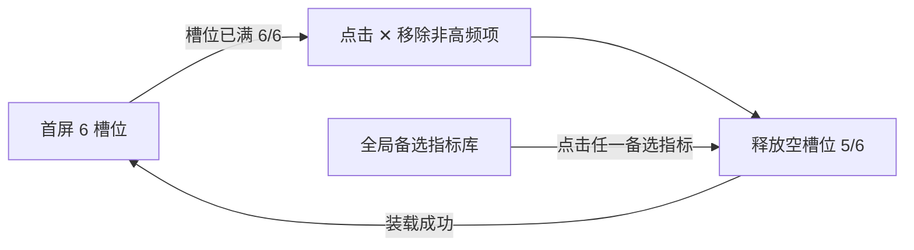

# 模块六：家庭档案与专属6项槽位定制设计规格书 (P6)

> **所属系统**：安康记 (AnkangCare) 移动端  
> **文档代号**：SPEC-MODULE-06  
> **状态**：正式发布 (Approved)

---

## 1. 业务背景与设计动机 (Motivation)

一个家庭内部通常包含 3~6 口人，每个人的身体焦点截然不同：
- 婴儿安安需要频繁记录奶量、大便、体温、辅食、用药、睡眠；
- 爷爷张大爷需要频繁记录尿酸、血压、服药、饮水、排便、计步；
- 妈妈林女士需要频繁记录饮水、体重、睡眠、生理期、饮食、心情。

> [!NOTE] 为什么必须限制首屏为 6 项专属槽位？
> 人类短时工作记忆容量受限于米勒定律（7±2 项）。将指标全部平铺在首屏会导致严重的“选择瘫痪”与视觉疲劳。通过**“固定 6 槽位热插拔定制”**，让每个家庭成员只保留自己最高频的 6 个核心动作，极大降低日常打卡的心理门槛。

---

## 2. 6 槽位热插拔定制机制 (Hot-Swappable 6 Slots)

### 2.1 全局备选指标库清单 (Metric Catalog)

| 指标代号 | 图标 | 指标名称 | 适用主要人群 | 默认录入类型 |
| :--- | :--- | :--- | :--- | :--- |
| `milk` | 🍼 | 记奶量 | 婴幼儿 (0~3岁) | 容量胶囊 (ml) / 母乳秒表 |
| `poop` | 💩 | 记便便 | 全体家庭成员 | 布里斯托 7 级图谱 + 颜色 |
| `temp` | 🌡️ | 记体温 | 儿童急病 / 发热期 | 0.1℃ 精度微调步进器 |
| `diet` | 🥣 | 记辅食/饮食 | 婴儿辅食 / 控糖控酸人群 | 智能标签 + 拍照备忘 |
| `med` | 💊 | 记用药/打卡 | 急病退热 / 慢病长辈 | 药箱列表 + 安全倒计时校验 |
| `sleep` | 😴 | 记睡眠 | 婴儿作息 / 成人睡眠 | 入睡与醒来时间段选择 |
| `uric` | 🧪 | 记尿酸 | 高尿酸 / 痛风长辈 | 5 μmol/L 精度步进器 |
| `bp` | ❤️ | 记血压 | 高血压长辈 | 高压/低压/脉搏三元数值 |
| `water` | 💧 | 记饮水 | 控酸老人 / 哺乳宝妈 / 成人 | 毫升快捷胶囊 (ml) |
| `weight`| ⚖️ | 记体重 | 婴儿发育 / 成人体重管理 | kg 数值输入 + BMI 自动计算 |
| `period`| 🌸 | 记生理期 | 育龄女性 | 经期第 N 天与流量打卡 |
| `cough` | 🗣️ | 记咳嗽 | 呼吸道疾病儿童 | 咳嗽音型与频次打卡 |
| `glucose`| 🩸 | 测血糖 | 糖尿病人群 | 空腹/餐后 2h 血糖打卡 |
| `steps` | 🚶 | 记步数 | 老年长辈日常活动 | 每日万步步数打卡 |

---

## 3. 家庭档案与特异体质过敏源库 (Health Profile)

特异体质与过敏史是预防家庭医疗事故的底线，本模块建立全局交叉比对机制：

### 3.1 成员档案数据结构
- **基础身份**：真实姓名/昵称、角色关系（如次子、长辈、本人）、性别、出生日期（自动计算精确至“岁”或“月龄”）；
- **食物过敏源清单**：鸡蛋清、牛奶蛋白、花生坚果、海鲜虾蟹、小麦等；
- **药物过敏源清单 (红线)**：青霉素类、头孢菌素类、阿司匹林、磺胺类等；
- **基础慢病/体质标签**：高尿酸血症、高血压、婴儿湿疹倾向、蚕豆病 (G6PD 缺乏症)。

### 3.2 全局交叉核验防踩坑规则
1. **就诊单自动嵌入**：当生成儿科门诊交接单时，系统自动提取该成员的过敏源清单，以醒目标签置顶，医生开具医嘱时一目了然；
2. **辅食与饮食防踩坑**：当家长在辅食打卡中输入含有已标记过敏源的食材时（如为安安添加蛋清米粉），系统即刻弹出警示：“安安存在鸡蛋清湿疹史，请谨慎引入新食材！”。

---

## 4. 场景监护模式开关与协同权限 (Mode Controls)

### 4.1 核心全局开关
1. **急病发热监护模式 (Illness Mode Toggle)**：
   - 开启后：首页首屏强制置顶双轴走势与退热药安全罗盘；
   - 关闭后：恢复为平稳日常 6 卡片看板。
2. **长辈关怀大字模式 (Senior Mode Toggle)**：
   - 针对老人设备或子女代管老人视图时开启，全局字体放大 125%，触控区域加大。
3. **实时家庭协同推送 (Co-Care Notification Toggle)**：
   - 当其他家属记录数据时（如阿姨记录了宝宝吃奶 150ml），即刻向监护人推送通知卡片；支持按成员单独开启或免打扰设置。
